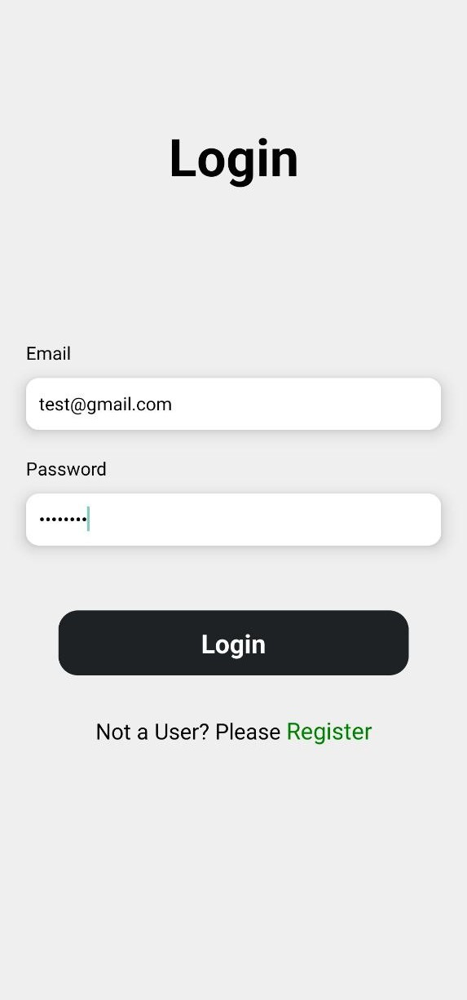
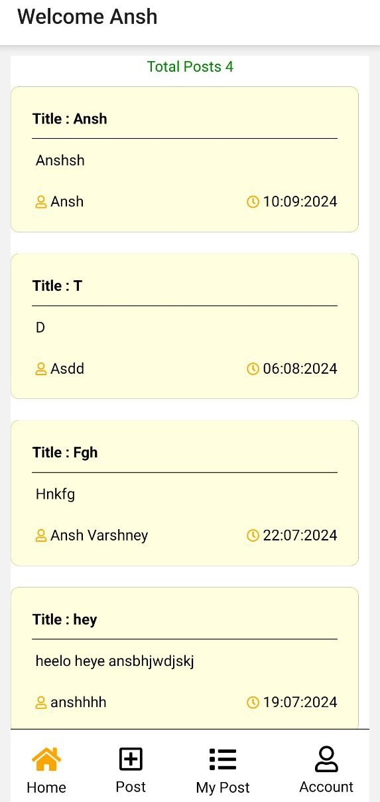
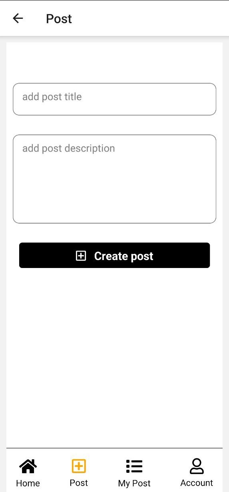
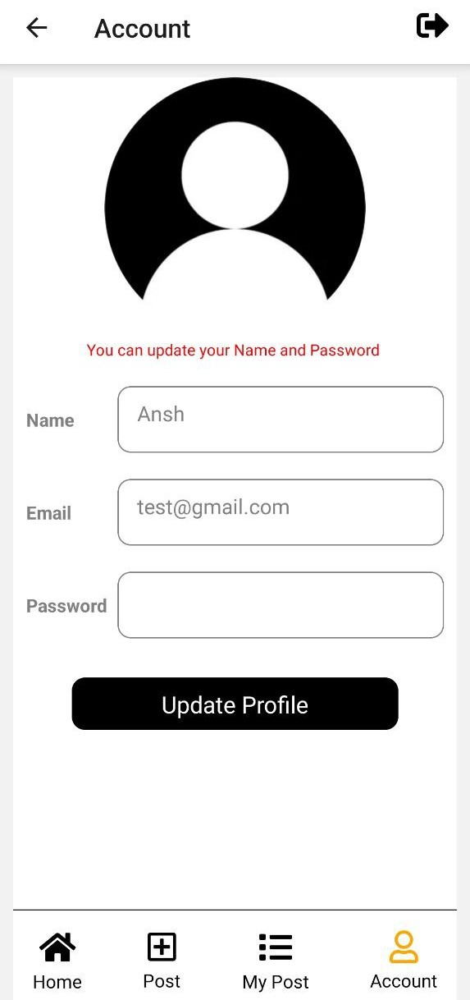

# ✍️ BlogMaster

BlogMaster is a dynamic blog application built using React Native for the frontend and a backend powered by Express, Node.js, and MongoDB. It offers a seamless and engaging platform for users to create, read, update, and delete blog posts.

## ✨ Features

- **🔐 User Authentication**: Sign up, log in, and manage user profiles.
- **📝 Create Posts**: Write and publish blog posts.
- **👀 Read Posts**: Browse and read blog posts.
- **✏️ Edit Posts**: Update your existing blog posts.
- **🗑️ Delete Posts**: Remove your blog posts.
- **💬 Comments**: Add and view comments on blog posts.

## 🛠️ Tech Stack

- **📱 Frontend**: React Native, JavaScript
- **🌐 Backend**: Node.js, Express.js
- **🗄️ Database**: MongoDB

## 📸 Screenshots

Here are some screenshots of the app in action:

### Login, Register, and Home Screen

  

      
    
*Login Screen*

  

  

      
    
*Register Screen*

  

### Create Post, My Post, and Account Details

  

      
    
*Home Screen*

  

  

      
    
*Create Post*

  

  

      
    
*My Post*

  

  

      
    
*Account Details*

  

